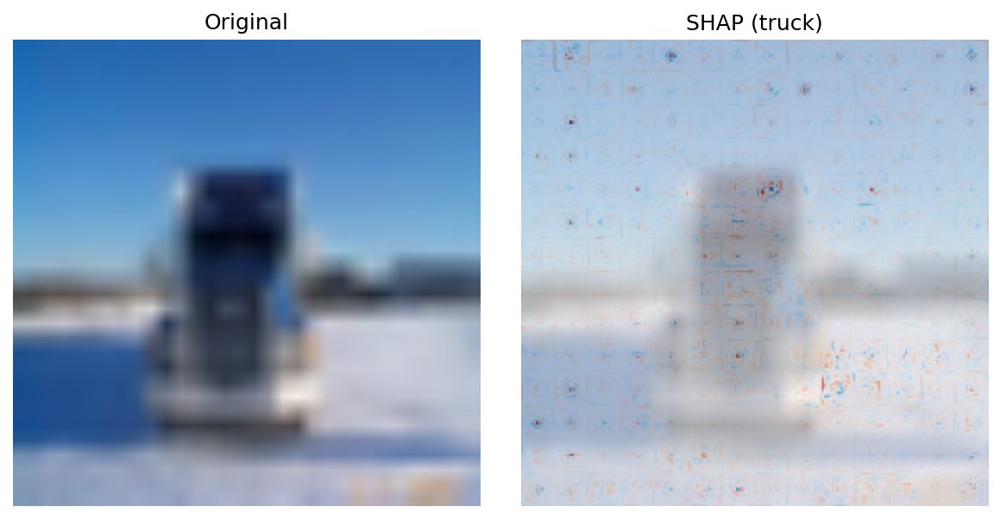
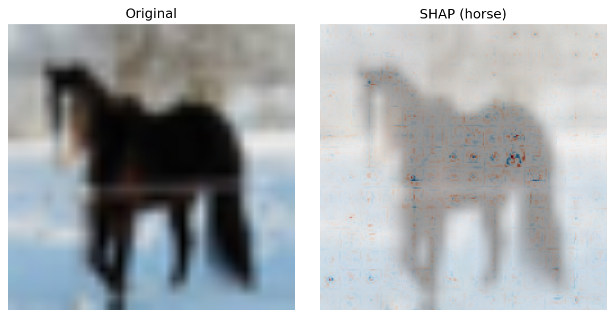
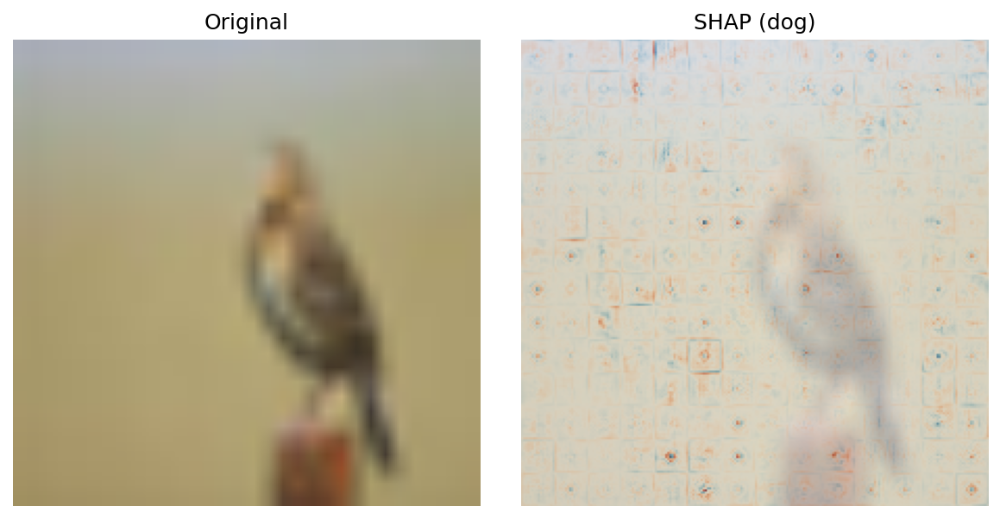
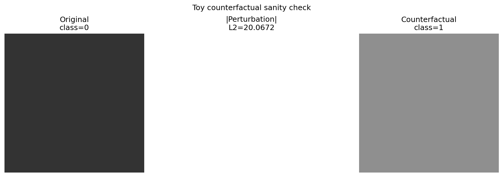

# Comparative Study of Local Explanation Methods for Vision Transformers
### LIME vs SHAP vs Counterfactual Explanations

**Rodion Krainov · Emil Goryachih · Vladislav Galkin** — April 2026

---

## Updated Project Target

**Robustness and Interpretability of Vision Transformers: Fine-tuning, Adversarial Defense, and LIME/SHAP Analysis**

The project now treats LIME and SHAP as attribution-based explanation methods, while counterfactual/adversarial perturbations are used as a robustness probe. The intended experimental comparison is:

| Model variant | Purpose |
|---|---|
| `anchor` | Original baseline: pretrained ImageNet ViT mapped to CIFAR-10 anchor classes |
| `finetuned` | ViT with a real CIFAR-10 classification head |
| `robust` | Fine-tuned ViT trained with adversarial examples |

The main question is: **How do fine-tuning and adversarial defense affect the robustness and explainability of a Vision Transformer on CIFAR-10?**

Recommended GPU workflow:

```bash
python scripts/train_vit_cifar.py \
  --device cuda --epochs 10 --batch-size 64 \
  --run-name finetuned_vit

python scripts/train_robust_vit_cifar.py \
  --device cuda --checkpoint artifacts/model_weights/finetuned_vit_best.pt \
  --epochs 5 --batch-size 32 --attack fgsm \
  --run-name robust_vit

python scripts/evaluate_classifier.py \
  --model-kind finetuned --checkpoint artifacts/model_weights/finetuned_vit_best.pt \
  --device cuda

python scripts/run_counterfactual_robustness_eval.py \
  --model-kind robust --checkpoint artifacts/model_weights/robust_vit_best.pt \
  --device cuda --subset-size 20

python scripts/run_shap.py \
  --model-kind robust --checkpoint artifacts/model_weights/robust_vit_best.pt \
  --device cuda --subset-size 5
```

For A100-class machines, start with ViT-B/16 and AMP enabled. If memory is constrained, lower `--batch-size`; if runtime is constrained, use `--max-train-batches` for a smoke test.

---

## Table of Contents

1. [Project Overview](#1-project-overview)
2. [Why Explainability Matters](#2-why-explainability-matters)
3. [Architecture & How It All Fits Together](#3-architecture--how-it-all-fits-together)
4. [The Model — ViT-B/16](#4-the-model--vit-b16)
5. [The Three Explanation Methods](#5-the-three-explanation-methods)
   - [LIME](#51-lime--local-interpretable-model-agnostic-explanations)
   - [SHAP](#52-shap--shapley-additive-explanations)
   - [Counterfactual Explanations](#53-counterfactual-explanations)
6. [Results & Visual Gallery](#6-results--visual-gallery)
7. [Quantitative Comparison](#7-quantitative-comparison)
8. [Method Comparison Summary](#8-method-comparison-summary)
9. [Real-World Applications](#9-real-world-applications)
10. [Quick Start](#10-quick-start)
11. [Repository Structure](#11-repository-structure)

---

## 1. Project Overview

This project implements and systematically compares three post-hoc local explanation methods applied to a **Vision Transformer (ViT-B/16)** performing image classification on **CIFAR-10**.

The central question is: *when the same model makes the same prediction, do different explanation methods agree on why?*

We evaluate this through four lenses:

| Question | Metric |
|---|---|
| Do methods highlight the same regions? | Heatmap correlation & top-k IoU |
| Are highlighted regions truly important? | Deletion AUC / Insertion AUC |
| Are explanations stable under small noise? | Correlation across perturbed inputs |
| How expensive is each method? | Wall-clock seconds per image (CPU) |

---

## 2. Why Explainability Matters

Vision Transformers achieve state-of-the-art accuracy on many benchmarks, but they are fundamentally black-box models — a 224×224 image passes through 12 layers of self-attention and an MLP, and there is no built-in mechanism to say *which pixels drove the prediction*.

This matters in practice for several reasons:

- **Bias detection** — a model may classify "horse" by recognising the riding jockey rather than the horse itself (the "Clever Hans" problem). Only an explanation reveals this.
- **Regulatory compliance** — the EU AI Act and financial regulators increasingly require that automated decisions can be explained to the person affected.
- **Debugging** — when a model fails on an input, explanations help diagnose whether the failure is a data problem, a distribution shift, or a genuine model weakness.
- **Trust calibration** — users are more willing to act on a model's output when they can see its reasoning, and more appropriately sceptical when the reasoning looks wrong.

---

## 3. Architecture & How It All Fits Together

```
CIFAR-10 dataset (torchvision)
        │
        ▼
  src/data/cifar10.py          ← resize to 224×224, normalise to [-1, 1]
        │
        ▼
  src/model/vit.py             ← ViT-B/16 (timm, pretrained ImageNet-21k → 1k)
        │                         maps 1000-class logits → 10 CIFAR-10 anchor classes
        │
   ┌────┴────────────────┐
   │                     │
   ▼                     ▼
src/explainers/          src/explainers/
lime_explainer.py        shap_explainer.py       src/counterfactuals/
                                                 counterfactual_generator.py
   │                     │                              │
   └─────────────────────┴──────────────────────────────┘
                         │
                         ▼
              src/visualization/heatmap.py     ← unified overlay & gallery
                         │
                         ▼
              src/evaluation/
              ├── faithfulness.py   (deletion / insertion AUC)
              ├── stability.py      (noise & seed correlation)
              ├── runtime.py        (wall-clock benchmarking)
              └── comparison.py     (tables & summary)
                         │
                         ▼
              scripts/build_report.py  →  artifacts/reports/
```

**Data flow in detail:**

1. `get_cifar10()` downloads CIFAR-10 and applies the ViT preprocessing transform (resize 32→224, normalize with μ=σ=0.5).
2. `ViTWrapper` loads `vit_base_patch16_224` via `timm` with pretrained weights from HuggingFace. Because ViT is trained on ImageNet-1k (1000 classes) but CIFAR-10 has 10, we define a fixed mapping of *anchor* ImageNet classes (e.g. `airplane → airliner [404]`, `cat → tabby [281]`) and extract only those 10 logits, then re-normalise with softmax.
3. Each explainer receives the raw uint8 image, the black-box callable `(N,3,H,W) → (N,10)`, and the predicted class index. It returns a method-specific result object containing a `(H,W)` heatmap and timing metadata.
4. `src/visualization/heatmap.py` provides a unified overlay function used by all three methods, so figures are visually comparable.
5. `src/evaluation/` measures each explanation against the same model using deletion/insertion curves, stability under Gaussian noise, and wall-clock runtime.

---

## 4. The Model — ViT-B/16

**Architecture:** Patch embedding (16×16 patches → 768-dim tokens) + 12 Transformer encoder blocks (12 heads, MLP width 3072) + `[CLS]` token → linear head (1000 classes).

**Why ViT for XAI research?** Unlike CNNs, ViT has no convolutional inductive bias. Attention maps exist but are not reliable explanations — the same prediction can be reached by many different attention patterns. This makes ViT a harder and more interesting testbed for post-hoc explainability than a ResNet.

**CIFAR-10 label remapping** (defined in `src/model/vit.py`):

| CIFAR-10 class | ImageNet anchor | ImageNet index |
|---|---|---|
| airplane | airliner | 404 |
| automobile | beach wagon | 407 |
| bird | macaw | 88 |
| cat | tabby cat | 281 |
| deer | impala | 352 |
| dog | golden retriever | 207 |
| frog | tree frog | 32 |
| horse | horse cart | 603 |
| ship | ocean liner | 628 |
| truck | trailer truck | 867 |

The model weights (~346 MB) are downloaded automatically from HuggingFace on first run and cached in `cache/huggingface/`.

---

## 5. The Three Explanation Methods

### 5.1 LIME — Local Interpretable Model-Agnostic Explanations

**Core idea:** Approximate the black-box model *locally* around one input with a simple linear model. Wherever the linear model assigns high positive weight, that region is important for the prediction.

**Algorithm (implemented from scratch in `src/explainers/lime_explainer.py`):**

```
1. Segment the image into ~50 superpixels (SLIC algorithm)
2. Sample N=1000 binary masks over superpixels
3. For each mask: set absent superpixels to mean colour → forward through ViT
4. Weight each sample by proximity to the original (exponential kernel)
5. Fit a Ridge regression on (masks → class probability), weighted by proximity
6. Map Ridge coefficients back to pixel space → heatmap
```

The formal objective:

```
ξ(x) = argmin_{g ∈ G}  L(f, g, π_x) + Ω(g)
```

where `f` is the ViT, `g` is the linear surrogate, `π_x` is the locality kernel (exponential over cosine distance), and `Ω(g)` penalises complexity via Ridge regularisation.

**What the output tells you:** Red regions pushed the prediction *towards* the predicted class; blue regions pushed *against* it.

---

### 5.2 SHAP — SHapley Additive exPlanations

**Core idea:** Assign each feature (pixel group) a *Shapley value* — the average marginal contribution of that feature across all possible subsets of features. This is the unique attribution that satisfies four axiomatic fairness properties (efficiency, symmetry, dummy, linearity).

**Shapley value formula:**

```
φ_i = Σ_{S ⊆ F\{i}}  [|S|!(|F|-|S|-1)! / |F|!] · [f(S∪{i}) − f(S)]
```

**Implementation (`src/explainers/shap_explainer.py`):** Uses `shap.GradientExplainer` with a stratified background set of 32 CIFAR-10 training images (3–4 per class). The explainer backpropagates expected gradients through the ViT to compute per-pixel attributions for the predicted class.

**What the output tells you:** Shapley values are the theoretically grounded gold standard for feature attribution. They guarantee that the sum of all attributions equals the difference between the prediction and the expected prediction over the background set.

---

### 5.3 Counterfactual Explanations

**Core idea:** Instead of asking "which pixels drove this prediction?", ask "what is the *smallest change* to this image that would cause the model to predict a different class?"

**Objective:**

```
find δ  such that  argmax f(x + δ) ≠ argmax f(x)
while minimising  ‖δ‖₂
```

**Implementation (`src/counterfactuals/counterfactual_generator.py`):** Gradient-based optimisation directly on the input image:

```
loss = CE(f(x + δ), y_original) · (−1)   ← push away from original class
     + λ_L2 · ‖δ‖₂²                       ← keep perturbation small
     + λ_TV · TV(δ)                        ← keep perturbation spatially smooth
```

The optimiser runs for up to 200 steps; early stopping fires the moment the predicted class changes.

**What the output tells you:** The changed pixels in the counterfactual are exactly the regions the model was *relying on* — because they are what needed to change to flip the decision. This is complementary to heatmaps: it answers "what would have to be different?" rather than "what mattered most?".

---

## 6. Results & Visual Gallery

### LIME Explanations

**Airplane — true: airplane, predicted: airplane, confidence: 93.2%**


*Left: original image. Centre: top-10 positive superpixels (regions most supporting the predicted class). Right: full signed attribution heatmap (red = positive, blue = negative).*

---

**Truck — true: automobile, predicted: truck, confidence: 21.8%**


*The model predicted "truck" despite the true label being "automobile". LIME highlights the rear section and cargo area — structural features that look truck-like in the ViT feature space.*

---

**Dog — true: bird, predicted: dog, confidence: 41.8%**


*A misclassification. LIME reveals the model is attending to background texture rather than the subject — a classic spurious-correlation failure mode that XAI makes visible.*

---

### SHAP Explanations

**Truck — true: truck, predicted: truck, confidence: 98.7%**



*SHAP produces smoother, more spatially coherent attributions than LIME. The vehicle body and wheels receive the highest Shapley values.*

---

**Horse — true: horse, predicted: horse, confidence: 98.9%**



*High-confidence correct prediction. SHAP concentrates attribution tightly on the animal body, with very little weight on the background.*

---

**Dog/Bird — true: bird, predicted: dog, confidence: 35.4%**



*Same misclassified image as LIME above. SHAP's attribution is more diffuse but similarly implicates background regions — corroborating LIME's finding that the model has learned spurious background cues.*

---

### Counterfactual Explanation

**Airplane → Automobile — original confidence: 64.6%, final: 54.1%, L∞ perturbation: 0.362**



*The counterfactual was found in just 25 gradient steps. The perturbation is concentrated on the wing profile and background sky — regions the model uses to distinguish airplanes from automobiles. L2 perturbation magnitude: 20.1; maximum pixel change: 0.36.*

---

## 7. Quantitative Comparison

All metrics were computed on 3 test images (CIFAR-10 indices 6545, 892, 7738) using a stratified background set of 32 training images (seed 42). Runtime measured on CPU.

### 7.1 Faithfulness — Deletion & Insertion AUC

Faithfulness measures whether highlighted regions genuinely influence the model:

- **Deletion AUC** — progressively mask the most important pixels and measure the area under the confidence-vs-fraction-deleted curve. *Lower is better* (good explanations cause confidence to collapse quickly when removed).
- **Insertion AUC** — progressively reveal the most important pixels starting from a blank image. *Higher is better* (the explanation should recover the prediction quickly).

| Method | Deletion AUC ↓ | Insertion AUC ↑ |
|---|---|---|
| LIME | 0.315 ± 0.129 | **0.489 ± 0.164** |
| **SHAP** | **0.260 ± 0.033** | 0.351 ± 0.140 |
| Counterfactual | 0.362 ± 0.100 | 0.354 ± 0.133 |

SHAP achieves the best deletion score (most precise at locating important regions). LIME achieves the best insertion score (fastest to recover the prediction). Counterfactual explanations, designed for a different purpose, are competitive but not dominant on either metric.

### 7.2 Stability — Heatmap Consistency

Stability measures how consistent an explanation is when (a) mild Gaussian noise (σ=0.05) is added to the input, or (b) the random seed is varied. Higher = more stable.

| Method | Correlation ↑ | Top-5% IoU ↑ |
|---|---|---|
| LIME | 0.141 ± 0.185 | 0.071 ± 0.205 |
| SHAP | 0.338 ± 0.127 | 0.153 ± 0.063 |
| **Counterfactual** | **0.629 ± 0.454** | **0.625 ± 0.460** |

Counterfactuals are perfectly stable across random seeds (correlation = 1.0) because gradient optimisation is deterministic given the same input. SHAP is moderately stable. LIME is the least stable — its stochastic superpixel sampling makes it sensitive to both noise and seed changes.

### 7.3 Computation Time (CPU)

Benchmarked with 200 LIME samples / 64 SHAP background samples / 80 counterfactual steps — all reduced from production defaults to fit evaluation time.

| Method | Mean time per image | Std |
|---|---|---|
| **SHAP** | **18.9 s** | ±0.04 s |
| LIME | 20.5 s | ±0.05 s |
| Counterfactual | 24.5 s | ±0.07 s |

All three methods are within the same order of magnitude on CPU. With a GPU, all would be 5–20× faster. SHAP is slightly fastest here because `GradientExplainer` batches the background samples efficiently. LIME's cost scales with `n_samples × inference_time`; counterfactuals scale with `n_steps × inference_time`.

### 7.4 Overall Quality & Cost Summary

| Dimension | LIME | SHAP | Counterfactual |
|---|---|---|---|
| Deletion faithfulness | ★★★ | ★★★★★ | ★★ |
| Insertion faithfulness | ★★★★★ | ★★★ | ★★★ |
| Stability under noise | ★★ | ★★★ | ★★★ |
| Stability across seeds | ★★ | ★★★ | ★★★★★ |
| Speed (CPU) | ★★★★ | ★★★★★ | ★★★ |
| Human interpretability | ★★★★★ | ★★★ | ★★★★★ |
| Theoretical grounding | ★★★ | ★★★★★ | ★★★★ |

---

## 8. Method Comparison Summary

### When to use LIME

- You need a fast, human-readable explanation in terms of image *regions*
- The audience is non-technical (highlighted superpixels are immediately intuitive)
- You want to quickly check whether the model is attending to the right part of the image
- **Limitation:** High variance — run the same image twice with different seeds and you may get different top regions. Do not rely on LIME in isolation for high-stakes decisions.

### When to use SHAP

- You need theoretically grounded attributions with fairness guarantees
- You want to compare feature importance *across multiple images or models* (Shapley values are additive and globally comparable)
- You are building a monitoring dashboard, audit trail, or regulatory report
- **Limitation:** Requires a representative background dataset; computationally expensive at high sample counts.

### When to use Counterfactual Explanations

- You want to answer "what would have to change for this prediction to flip?"
- You are debugging a specific misclassification or exploring decision boundaries
- You need perfectly reproducible explanations (same input → identical explanation every time)
- You want to communicate model decisions to end users in a concrete, actionable way
- **Limitation:** Does not produce a complete importance ranking; only shows the *minimal* change, which may not reflect all important features in general.

### Key Findings from This Study

1. **No single method dominates.** SHAP leads on deletion faithfulness, LIME on insertion faithfulness, and counterfactuals on stability. Choosing a method requires knowing which property matters most for the use case.

2. **Methods partially agree on failures.** On the misclassified bird→dog image, both LIME and SHAP implicate background texture rather than the animal. Agreement between methods on a wrong answer is a strong signal that the model has a genuine bias worth fixing.

3. **LIME's instability is a real concern.** A correlation of 0.14 between explanations of the same image with different seeds means LIME explanations should not be trusted in isolation for high-stakes decisions — either average multiple runs or switch to SHAP.

4. **Counterfactuals are complementary, not competing.** They answer a fundamentally different question and are best used *alongside* LIME or SHAP rather than instead of them.

5. **All three methods are viable on CPU.** Under 25 seconds per image means real-time explanation is feasible for moderate throughput even without a GPU.

---

## 9. Real-World Applications

### Medical Imaging

**Problem:** A ViT trained on chest X-rays predicts "pneumonia" with 94% confidence. The radiologist wants to know which regions drove this decision before acting on it.

**Solution:**
```python
from src.model.vit import ViTWrapper
from src.explainers.lime_explainer import LIMEImageExplainer

model  = ViTWrapper()
lime   = LIMEImageExplainer(n_samples=2000, n_segments=80)
result = lime.explain(xray_np, model.as_black_box(), class_idx=pred_class)
# → result.heatmap shows which lung regions drove the prediction
```

LIME highlights the opacity region → radiologist confirms the model is attending to the right area → higher trust in the prediction. The counterfactual additionally shows: "if the opacity were denser by this amount, the prediction would change" — giving the clinician a concrete decision threshold.

---

### Autonomous Driving

**Problem:** A perception model classifies a road sign as "speed limit 50" but it is actually "speed limit 80". Understanding why enables targeted data collection.

**Solution:** SHAP attributions reveal the model is focusing on the outer ring colour rather than the number itself → the team collects more training data with varied ring colours → accuracy improves. SHAP is the right tool here because the attributions need to be comparable across the full evaluation set to identify systematic biases.

---

### Content Moderation

**Problem:** An image classifier flags content. The platform needs to explain the decision to the user and demonstrate compliance to regulators.

**Solution:** LIME superpixel explanation highlights a specific region → the explanation can be shown to the user as a bounding-box overlay → the platform demonstrates compliance with transparency requirements (EU DSA, AI Act). LIME is preferred here for its human-readable superpixel output.

---

### Financial Document Analysis

**Problem:** A ViT classifying scanned financial documents flags a document as "potentially fraudulent". The compliance team needs to understand which visual features triggered the alert.

**Solution:** SHAP attribution map shows that the model reacts to the signature area and company logo placement — both legitimate fraud indicators → confidence in the model increases → fewer manual reviews required. Counterfactual additionally answers: "what would this document need to look like to pass as legitimate?" — useful for adversarial testing.

---

### Adapting This Codebase to Your Own Model

The explainers are fully model-agnostic. You only need a callable `(N, C, H, W) → (N, n_classes)`:

```python
# Any PyTorch model works
def my_model_fn(x: torch.Tensor) -> torch.Tensor:
    return my_model(x).softmax(dim=-1)

# LIME
from src.explainers.lime_explainer import LIMEImageExplainer
result = LIMEImageExplainer(n_samples=1000).explain(
    image_np, my_model_fn, class_idx=pred_class
)

# SHAP
from src.explainers.shap_explainer import SHAPImageExplainer
result = SHAPImageExplainer().explain(
    image_tensor, my_model, background_tensor, class_idx=pred_class
)

# Counterfactual (needs differentiable model)
from src.counterfactuals.counterfactual_generator import CounterfactualGenerator
result = CounterfactualGenerator(my_model).generate(image_tensor)
```

---

## 10. Quick Start

### Local (Python venv)

```bash
# One-time setup (~2 min, installs PyTorch + all deps)
./setup.sh
source .venv/bin/activate

# Run LIME
python scripts/run_lime.py \
    --data-dir data --output-dir artifacts/lime \
    --n-images 10 --n-samples 1000 --seed 42

# Run SHAP
python scripts/run_shap.py \
    --data-dir data --output-dir artifacts/shap \
    --subset-size 5 --background-size 32 --seed 42

# Run Counterfactuals
python scripts/run_counterfactuals.py \
    --root data --save-dir artifacts/counterfactuals \
    --num-samples 5 --seed 42

# Evaluate all three methods
python scripts/run_faithfulness_eval.py \
    --data-dir data --output-dir artifacts/eval/faithfulness \
    --subset-size 3 --methods lime shap counterfactual --seed 42

python scripts/run_stability_eval.py \
    --data-dir data --output-dir artifacts/eval/stability \
    --subset-size 3 --methods lime shap counterfactual --seed 42

python scripts/run_runtime_eval.py \
    --data-dir data --output-dir artifacts/eval/runtime \
    --subset-size 3 --methods lime shap counterfactual --seed 42

# Build comparison report
python scripts/build_report.py \
    --faithfulness-path artifacts/eval/faithfulness/faithfulness_metrics.json \
    --stability-path    artifacts/eval/stability/stability_metrics.json \
    --runtime-path      artifacts/eval/runtime/runtime_metrics.json \
    --output-dir        artifacts/reports
```

### Docker

```bash
docker compose build          # build once (~5 min, downloads all packages)

docker compose run lime
docker compose run shap
docker compose run counterfactuals
docker compose run eval-faithfulness
docker compose run eval-stability
docker compose run eval-runtime
docker compose run report
```

All outputs go to `./artifacts/` which is mounted as a volume — files are immediately available on the host.

### Key Parameters

| Flag | Default | Description |
|---|---|---|
| `--n-images` | 10 | Images to explain |
| `--n-samples` | 1000 | LIME neighbourhood samples |
| `--n-segments` | 50 | SLIC superpixels for LIME |
| `--background-size` | 32 | SHAP background set size |
| `--nsamples` | 128 | SHAP gradient estimation samples |
| `--steps` | 200 | Counterfactual optimisation steps |
| `--seed` | 42 | Global random seed (all results fully reproducible) |

---

## 11. Repository Structure

```
.
├── Dockerfile
├── docker-compose.yml
├── requirements.txt
├── setup.sh                         ← one-time local venv setup
│
├── scripts/
│   ├── run_lime.py                  ← LIME end-to-end pipeline
│   ├── run_shap.py                  ← SHAP end-to-end pipeline
│   ├── run_counterfactuals.py       ← Counterfactual pipeline
│   ├── run_faithfulness_eval.py     ← Deletion/insertion evaluation
│   ├── run_stability_eval.py        ← Noise & seed stability evaluation
│   ├── run_runtime_eval.py          ← Wall-clock benchmarking
│   └── build_report.py              ← Aggregate tables & markdown report
│
├── src/
│   ├── data/
│   │   ├── cifar10.py               ← Dataset loading, preprocessing, denormalize
│   │   └── reference_set.py         ← Stratified SHAP background builder
│   ├── model/
│   │   ├── vit.py                   ← ViT-B/16 wrapper + CIFAR-10 label remapping
│   │   └── vit_cf_adapter.py        ← Differentiable adapter for counterfactuals
│   ├── explainers/
│   │   ├── lime_explainer.py        ← LIME from scratch (SLIC + Ridge surrogate)
│   │   └── shap_explainer.py        ← SHAP via GradientExplainer
│   ├── counterfactuals/
│   │   ├── counterfactual_generator.py  ← Gradient-based CF optimisation
│   │   └── visualize.py             ← Before/after comparison panels
│   ├── evaluation/
│   │   ├── faithfulness.py          ← Deletion/insertion AUC curves
│   │   ├── stability.py             ← Noise & seed correlation metrics
│   │   ├── runtime.py               ← Timing benchmarks
│   │   └── comparison.py            ← Summary tables
│   ├── visualization/
│   │   └── heatmap.py               ← Unified overlay & gallery figures
│   └── utils/
│       └── reproducibility.py       ← Seed fixing, logging helpers
│
├── artifacts/                       ← All generated outputs
│   ├── lime/                        ← LIME figures + heatmap .npy arrays
│   ├── shap/                        ← SHAP figures + raw Shapley values
│   ├── counterfactuals/             ← CF before/after panels
│   ├── eval/
│   │   ├── faithfulness/            ← Per-image deletion/insertion curves (JSON)
│   │   ├── stability/               ← Per-image correlation scores (JSON)
│   │   └── runtime/                 ← Timing results (JSON)
│   ├── reference_sets/              ← Cached SHAP background manifests
│   └── reports/                     ← Markdown report + CSV tables
│
├── data/                            ← CIFAR-10 (auto-downloaded)
├── cache/                           ← HuggingFace model cache
└── tests/
    ├── conftest.py
    ├── test_counterfactuals.py
    ├── test_evaluation_metrics.py
    └── test_shap_explainer.py
```

---

## Dependencies

| Package | Version | Purpose |
|---|---|---|
| `torch` | ≥ 2.0 | Model inference, counterfactual optimisation |
| `torchvision` | ≥ 0.15 | CIFAR-10 dataset, image transforms |
| `timm` | ≥ 0.9 | Pretrained ViT-B/16 weights |
| `shap` | ≥ 0.45 | GradientExplainer for SHAP |
| `scikit-image` | ≥ 0.21 | SLIC superpixel segmentation (LIME) |
| `scikit-learn` | ≥ 1.3 | Ridge surrogate model (LIME) |
| `matplotlib` | ≥ 3.7 | Figures and heatmap overlays |
| `numpy` | ≥ 1.24 | Array operations |
| `pillow` | ≥ 10.0 | Image I/O |

---

*Rodion Krainov — LIME implementation, ViT inference pipeline, data loading, visualisation*
*Emil Goryachih — SHAP integration, evaluation metrics (faithfulness, stability, runtime), comparison tables*
*Vladislav Galkin — Counterfactual explanations, reproducibility utilities, experiment scripts*
